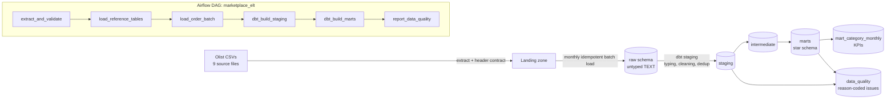
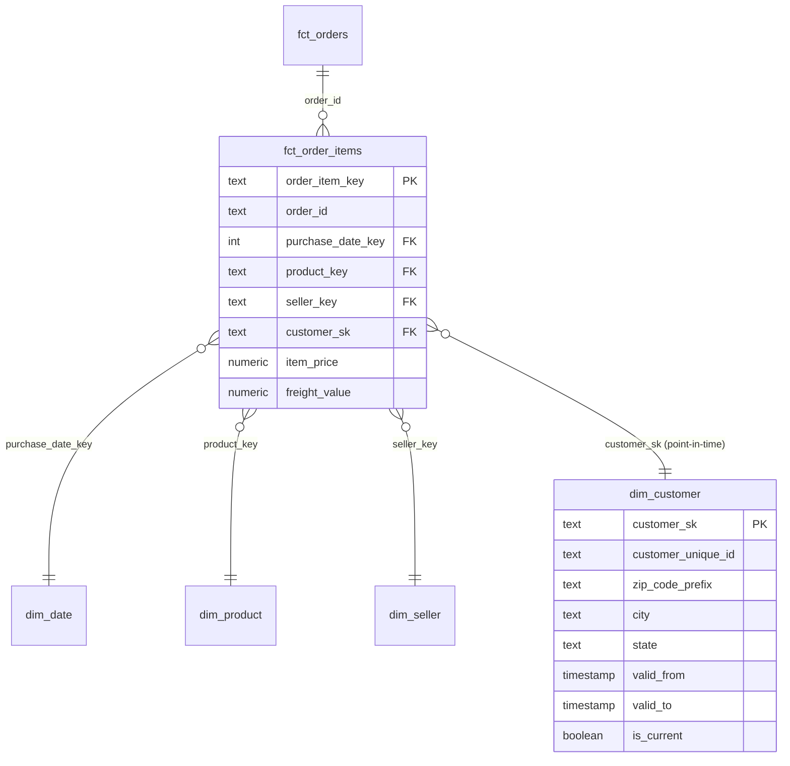

# Marketplace Analytics Warehouse

An ELT pipeline that loads the public [Olist Brazilian e-commerce dataset](https://github.com/olist/work-at-olist-data) into a PostgreSQL warehouse and models it as a star schema. **Apache Airflow** schedules the monthly batches and **dbt** transforms and tests the data.

The goal is to show the parts of data engineering that matter after the first successful load:

- incremental, idempotent batches
- source schema contracts
- dimensional modeling, including an SCD Type 2 dimension
- reconciliation back to the source
- data-quality rules that flag bad records instead of silently dropping them

## Architecture



## Data model



| Model | Type | Grain / notes |
|---|---|---|
| `fct_order_items` | Transaction fact, **incremental** | One row per order line. `delete+insert` on `order_item_key`, driven by the raw-load watermark. dbt **model contract enforced**. |
| `fct_orders` | Accumulating-snapshot fact | One row per order: lifecycle milestones, item/payment totals, delivery days, late flag, review score, `dq_*` flags. |
| `dim_customer` | **SCD Type 2** | Keyed on `customer_unique_id`. A new version starts when an order's address differs from the previous order's. Contract enforced. |
| `dim_product`, `dim_seller` | Type 1 | Products carry English category names; sellers carry zip-prefix centroid coordinates. |
| `dim_date` | Conformed date | 2016-01-01 to 2018-12-31. |
| `mart_category_monthly` | Metrics mart | Orders, units, GMV, freight, average item price, late-delivery rate, review score and cancel rate by category and month. Definitions live in `_marts.yml`. |
| `dq_issues`, `dq_summary` | Data quality | One row per rule violation with a reason code, plus per-rule counts. |

## Design decisions

- **The raw layer is schema-on-read.** Raw tables keep every source column as `TEXT` plus `_batch_id` and `_loaded_at`. Typing happens in staging, so a malformed value never blocks ingestion and the raw layer stays a faithful copy of the source.
- **Schema contracts at ingestion.** Every source declares its expected header in `include/ingestion/sources.py`. If a column is renamed, added or removed, the extract task fails before anything is loaded.
- **Idempotent monthly batches.** Each DAG run owns one purchase-date interval. It deletes and reloads its batch, and loads child rows (items, payments, reviews, customers) for exactly those orders. Reference tables reload only when the file checksum changes.
- **Ordered runs.** `max_active_runs=1` and `depends_on_past` on the batch load keep batches in purchase-date order, which the SCD2 dimension and the incremental fact rely on.
- **Point-in-time join.** Fact rows join to the customer version that was valid when the order was placed (`valid_from <= purchased_at < valid_to`). A singular test checks that the attached version's address matches the order's recorded address.
- **Surrogate keys are deterministic** (md5 of the natural key; for SCD2, key + `valid_from` + address). Rebuilding the dimension doesn't break foreign keys already written to the incremental fact.
- **Flag, don't drop.** Records that break data-quality rules stay in the facts with `dq_*` flags and are listed in `data_quality.dq_issues`. Fact totals still reconcile exactly to the source.
- **Tests gate each run.** `dbt build` runs tests right after each model, so a failed test stops everything downstream of it.

## Tests

- **50 dbt tests:**
  - uniqueness, not-null, accepted values, relationships
  - `no_overlapping_ranges`: a custom generic test for SCD2 validity ranges
  - fact-to-raw reconciliation of row count and item-price total
  - exactly one current version per customer
  - point-in-time join correctness
  - a warn-level payment-mismatch-rate threshold
- **5 pytest unit tests** for ingestion: schema-contract detection (renamed column, added column, byte-order mark) and monthly window splitting.

## Verified run

A full backfill ran locally on PostgreSQL 16, Airflow 3.3.2 and dbt 1.10: 26 monthly DAG runs (Sep 2016 – Oct 2018) with `airflow dags test`.

| Measure | Result |
|---|---|
| Raw rows loaded (9 source files) | 1,550,922 |
| Orders / order lines | 99,441 / 112,650 |
| Fact reconciliation to source | exact: row count and item-price total (13,591,643.70) |
| Incremental behaviour | Each run inserts only its own batch (e.g. Aug 2017: 4,910 rows) |
| Idempotency | Re-running Nov 2017 replaced its 8,665 fact rows; all totals unchanged |
| SCD2 customer dimension | 96,355 versions for 96,096 customers (259 address changes) |
| Geolocation | 1,000,163 raw points reduced to 19,010 zip-prefix centroids |
| dbt nodes per run | 20 models + 50 tests, 0 failures across all runs |
| Backfill wall time | ≈ 9 minutes for 26 runs |

**Data-quality findings in the source** (rows flagged, not dropped):

| Rule | Rows |
|---|---|
| Carrier pickup recorded before payment approval | 1,359 |
| Order with no items | 775 |
| Product missing a category | 610 |
| Payment differs from items + freight by more than 1.00 BRL | 313 |
| Category with no English translation | 13 |
| `delivered` status with no delivery date | 8 |
| Seller zip prefix missing from geolocation | 8 |

## Running it

### Docker (Airflow standalone + Postgres)

```bash
docker compose up --build
# Airflow UI: http://localhost:8080. The admin password is printed in the airflow container logs.
# Unpause `marketplace_elt`; catchup schedules the 26 monthly runs in order.
```

### Without Docker

Needs a Postgres database called `warehouse` with user and password `warehouse` on localhost:5432, or set `WAREHOUSE_DSN` and `WAREHOUSE_*`.

```bash
pip install -r requirements-dev.txt -r requirements-dbt.txt
make load   # extract, validate contracts, load monthly batches
make dbt    # dbt build: models + tests
make test   # unit tests
```

## Repository layout

```
dags/marketplace_elt.py          Airflow DAG
include/ingestion/               extract (contracts, checksums), load (idempotent batches), CLI
dbt/models/staging/              typing, cleaning, dedup, source tests
dbt/models/intermediate/         address observations, order totals, payments
dbt/models/marts/core/           facts and dimensions (contracts on key models)
dbt/models/marts/metrics/        category KPIs
dbt/models/data_quality/         reason-coded issue log and summary
dbt/tests/                       custom generic + singular tests
tests/                           pytest unit tests
```

## Data license

The Olist dataset is published by Olist under CC BY-NC-SA 4.0. It is downloaded at run time and not committed to this repository.
